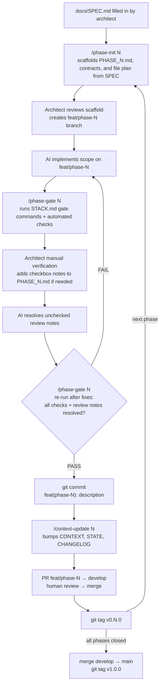

# SDD Template — Spec-Driven Development Pipeline

> A reusable pipeline for AI-assisted, phased delivery. The **architect** defines the product intent;
> `phase-init` scaffolds the phase contract and file plan; the **AI** implements within scope; **gates** enforce quality before every commit.

---

## What this template is

The SDD pipeline is a **stack-agnostic process** for delivering software in atomic, gated phases:

- **Documents** encode intent (`SPEC`), a living contract (`CONTEXT`), progress (`STATE`), a change history (`CHANGELOG`), and scoped tasks (`PHASE_XX`).
- **Workflow playbooks** under [docs/workflows/](docs/workflows/README.md) are the canonical procedures for phase scaffolding, gate checks, and doc synchronization.
- **Rules** in [AGENTS.md](AGENTS.md) and [CLAUDE.md](CLAUDE.md) keep AI agents inside the phase scope and force a passing gate before commit.
- **Repo memory files** keep durable decisions and recurring pitfalls stable across agent sessions.

The reference implementation ships with a concrete stack (FastAPI + Nuxt 4 + PostgreSQL + Docker).
Everything stack-specific — setup commands, directory layout, testing tools, migrations, and the
Nuxt `prepare` pre-step required before frontend type/tests — lives in
**[docs/STACK.md](docs/STACK.md)**. Swap that file when swapping stacks; the pipeline does not change.

---

## Quick start

1. **Initialise a new project** from this template:
   ```bash
   ./scripts/init-project.sh <project-slug> <domain> [admin-email]
   # Example: ./scripts/init-project.sh user-dashboard example.com admin@example.com
   ```
   The script replaces placeholders, generates `.env`, creates random secrets, and copies both `AGENTS.md` and `CLAUDE.md` into place.
   Prerequisites and post-init steps -> **[docs/STACK.md](docs/STACK.md#prerequisites)**.

2. **Fill in [docs/SPEC.md](docs/SPEC.md)** — strategic brief, goals, domain rules.

3. **Scaffold phase 1**: `/phase-init 01` — generates `docs/PHASE_01.md` from SPEC.

4. **Iterate the phase cycle** (diagram below) until all phases are closed, then release.

---

## Pipeline



**Mid-flight SPEC edits** -> run `/spec-sync [description]` before continuing.
Affected phases are marked `⚠️ NEEDS_REVIEW` in `docs/STATE.md` until resolved.

**Hotfixes** -> branch `hotfix/*` from `main`, merge into both `main` and `develop`.

---

## Skills (slash commands)

| Command | When to use |
|---------|-------------|
| `/spec-sync [description]` | Immediately after editing [docs/SPEC.md](docs/SPEC.md) |
| `/phase-init [N]` | To scaffold the next [docs/PHASE_XX.md](docs/PHASE_TEMPLATE.md) from SPEC |
| `/phase-gate [N]` | Before committing — runs the automated checks defined by [docs/STACK.md](docs/STACK.md#gate-commands) and fails if `Architect Review Notes` still contain unchecked items |
| `/context-update [N]` | After the gate passes — bumps `CONTEXT.md` version, updates `STATE.md` and `CHANGELOG.md` |

Skill wrappers live under [.claude/skills/](.claude/skills/) and [plugins/sdd-workflow/skills/](plugins/sdd-workflow/skills/).
The canonical workflow playbooks live under [docs/workflows/](docs/workflows/README.md).

---

## Key documents

| File | What it answers |
|------|----------------|
| [docs/SPEC.md](docs/SPEC.md) | What are we building? What are the rules? |
| [docs/CONTEXT.md](docs/CONTEXT.md) | What is in the system right now? (versioned contract) |
| [docs/STATE.md](docs/STATE.md) | Where are we in the process? What is blocked? |
| [docs/CHANGELOG.md](docs/CHANGELOG.md) | Why did the contract change? Which phases were affected? |
| [docs/PHASE_XX.md](docs/PHASE_TEMPLATE.md) | What exactly should the AI implement this iteration? |
| [docs/STACK.md](docs/STACK.md) | Stack-specific setup, testing, layout, and gate commands |
| [docs/DECISIONS.md](docs/DECISIONS.md) | Short ADR-style technical decisions worth remembering |
| [docs/KNOWN_GOTCHAS.md](docs/KNOWN_GOTCHAS.md) | Repeated pitfalls, symptoms, and shortest safe fixes |
| [docs/workflows/README.md](docs/workflows/README.md) | Canonical workflow playbooks for phase-init, gate, sync, and context update |
| [AGENTS.md](AGENTS.md) | Model-agnostic AI rules and workflow mapping |
| [CLAUDE.md](CLAUDE.md) | Claude-specific adapter for the shared rules |

---

## Philosophy

- **Architect defines intent, phase-init scaffolds contracts, AI fills them in.** The architect writes SPEC, reviews the phase scaffold, and approves merges. `phase-init` generates the phase contract and file plan, and the AI produces code, tests, and doc updates strictly inside that scope.
- **Contracts beat conventions.** Every phase has an explicit contract (scope, files, endpoints, types, env vars). Nothing implicit.
- **Gates, not promises.** Quality is proven by a passing `/phase-gate` report, not by the AI claiming "looks good".
- **Docs are alive.** `CONTEXT.md` is the single source of truth for what exists; `STATE.md` tracks progress; `CHANGELOG.md` records why things changed. `CONTEXT.md` must never lag more than one phase behind.

### Manual Verification Loop

`/phase-gate` is intentionally lightweight for manual review:

1. Run `/phase-gate N` to get the automated baseline. In the reference stack, this may be implemented with `./scripts/phase-gate.sh N`.
2. Manually verify the phase as the architect.
3. Record any findings in `docs/PHASE_XX.md` under `Architect Review Notes` as simple unchecked checklist items.
4. Have the AI fix those unchecked items and mark them resolved.
5. Run `/phase-gate N` again only after the fixes are in place.

Adding unchecked architect review notes by itself does not complete the loop. Those notes mean the phase is still open. The phase is only ready to commit when the fixes are done, the automated checks are green, and there are no unchecked architect review items left.

---

## Stack

This template's reference implementation is **FastAPI + Nuxt 4 + PostgreSQL + Docker**.
For prerequisites, environment setup, commands, project structure, testing, and per-module style guides, see **[docs/STACK.md](docs/STACK.md)**.
